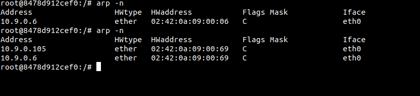
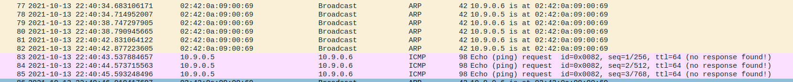

ARP Cache Poisoning Attack Lab
-------------------------------

# Overview
---------

Address Resolution Protocol is a communication protocol used for discovering link layer addresses. It is a simple protocol that does not implement any securit measures. 


# Lab Environment
----------------

To complete this lab I am using the lab setup provided by the [SEED security labs](https://seedsecuritylabs.org/Labs_20.04/Files/ARP_Attack/ARP_Attack.pdf).

Our container network will look like this:


From the VM the interface I will be sniffing packets on is br-758189db12f0.

We have 3 machines, for reference I will post their MAC Addresses here.

M-02:42:0a:09:00:69
B-02:42:0a:09:00:06 
A-02:42:0a:09:00:05 

## Task 1.A
------------
On host M we need to construct an ARP request packet and send it to host A. Then check A's arp cache to see if this works.

In order to construct the packet correctly with scapy we need to fill in the correct fields in the ARP request we send.
Opening a python shell we can see what the fields of the ARP packet in scapy are

```python3
>>> from scapy.all import *
>>> ls(ARP)
hwtype     : XShortField                         = (1)
ptype      : XShortEnumField                     = (2048)
hwlen      : FieldLenField                       = (None)
plen       : FieldLenField                       = (None)
op         : ShortEnumField                      = (1)
hwsrc      : MultipleTypeField                   = (None)
psrc       : MultipleTypeField                   = (None)
hwdst      : MultipleTypeField                   = (None)
pdst       : MultipleTypeField                   = (None)
```

In order to construct a request packet we need to fill in the correct header values. So we know M (our malicious machine) needs to be implanted in A's ARP cache as hardware address that is to receive traffic for 10.9.0.6 (B). Ok so we will have
`hwsrc = 02:42:0a:09:00:69` as the ehternet source of the ARP broadcast request. We will set the `psrc = 10.9.0.6`, this indicates the Sender protocol address. Now we need to target A's machine so set `hdst = 02:42:0a:09:00:05` as the hardware target address and `pdst= 10.9.0.5`. Lastly we need to give the operation code for the packet so `op=1` 1 is for a request, 2 is for a reply.

Using scapy to construct the packet we have something like this (arpconstruct.py)
```python3
#!/usr/bin/env python3
from scapy.all import *

'''
E=Ether()
## Arp sent from M to A, mapping M's MAC to B's address in A's ARP cache
A=ARP(hwsrc='02:42:0a:09:00:69', psrc ='10.9.0.6', hwdst= '02:42:0a:09:00:05', pdst = '10.9.0.5')

pkt = E/A
sendp(pkt, iface='eth0')
```

So I then send out the request and observe what happens over the interface eth0 on our VM.


The first broadcast that is sent out is from our own machine with its own IP address as the source. Why? because the malicious machine does not know the route to 10.9.0.5. This results in the first packet revealing our 10.9.0.105 address to A


And A's arp cache now looks like this:


Importantly I need to see if this works, will A send packets to M instead of B?

So I conduct an experiment with the ping program


Sending a ping to 10.9.0.6

We trace the traffic with wireshark


We see the ping get sent out to our machine's address (M) 


But our machine has no idea where 10.9.0.6 is, which causes it to broadcast an ARP request over the network trying to find 10.9.0.6

The real 10.9.0.6 follows up with an ARP response broadcasted over the network segment which fills in M's ARP cache for B's address. Now our Machine updates its ARP cache sends the ping from 10.9.0.105 to 10.9.0.6. Since the source of the packet is 10.9.0.5 and machine B has never communicated with it before, it sends out an ARP request to fill in its ARP cache with A's information. When A receives the broadcast a duplicate entry is detected in A's ARP cache and now the whole network knows that the ARP cache was wrong to begin with and it gets updated with the proper addresses.

 

And we can see in A's ARP cache the address is changed to the correct location of 10.9.0.6 and also our machine 10.9.0.105 has been revealed to both A and B and no traffic will be routed between them anymore unless we resend the spoofed ARP request. So this isn't really ideal for a man in the middle situation.


The question in the Lab simply asks if it works, the answer is yes it does work, but it is destined to fail if you try to use the request packet in a man in the middle situation.

## Task1.B Using ARP reply

So lets construct an ARP reply packet and see if that will work better than the request. So we need to keep all of the values the same, except this time we will change the code `op = 2` in the spoofed packet from 1 to 2.

Scenario 1: B's IP is already in A's cache.

From the last experiment B is already in A's cache, but I will delete the other entries from the other machines using `arp -d [entry name]`. Again I just change the code of the arp packet we created in arpconstruct.py, I will make a seperate file arpconstructreply.py to use for this task.

When we run arpconstructreply.py with B's address in the cache we can see that the result gets us the same as when we sent the reply with no cache data in A.



The IP address for B is overwritten by M's spoofed ARP, but we have the same problem. 10.9.0.105 has no idea how to communicate with 10.9.0.5 even though it has a MAC address, so the transmission begins with an ARP request from the M machine


This is followed by the spoofed ARP reply packet we sent.

Scenario 2: B's IP is not in A's cache.

So what if B's IP is not in A's cache? Again I will reset the experiment using `arp -d [entryname]` on all entries in A.
We have the same sequence of ARP packets when we send out the spoofed ARP from 10.9.0.105


This time A ignores the ARP reply indicating where B is located


A has no need to store B's address because a request has not been sent. So we only cache M in A's ARP cache, which is less than ideal.

# TASK 1.C
-------------------

Scenario 1: B is in A's Cache

Now we will examine the same two scenarios as in TASK 1.B with a ARP gratuitous message. The ARP gratuitous packet is a special ARP packet used when a host needs to update outdated information on ALL the other machine's ARP caches. 

So how to construct the gratuitous packet? We set the destination address as the broadcast MAC address `ff:ff:ff:ff:ff:ff` and keep the sender addresses the same (B's addresses). We also keep 10.9.0.5 as the target. Check out garpconstruct.py for the code.

Since a gratuitous ARP packet is meant to update existing tables it is no surprise when we activate the code on M we see this traffic


And we see A's cache has been updated with M's Mac address mapped to B's IP address.


Scenario 2: B is not in A's Cache

Lets delete the entry for B in A's cache and try the GARP packet again.


We see the same amount of traffic broadcast over the network.


And we can see that M's address becomes mapped to B's IP. Success!


# Task 2: MITM Attack on Telnet using ARP Cache poisoning
-----------------------------------------------------------

Now we need to use M as a MITM to intercept telnet traffic between A and B. So we will need to use the ARP Cache poisoning to change A's arp cache so that B's IP maps to M's IP, and B's arp cache so that A's address maps to M. So all packets sent between A and B will be intercepted by M.


This image was again from the [SEED security lab](https://seedsecuritylabs.org/Labs_20.04/Files/ARP_Attack/ARP_Attack.pdf) documents I am using to learn about ARP attacks.

So lets get to Scapy! We will use the same idea from task 1 to conduct the MITM attack. 

## Step 1: Launch the ARP cache poisoning Attack
I have defined the ARP cache poisoning in mitmARP.py as

```python3
# This function will Map B's address to M in A's cache, and A's
# Address to M in B's cache.
def arp_poison():
    ether = Ether(dst = 'ff:ff:ff:ff:ff:ff')
    arp1 = ARP(op = 2, hwdst = 'ff:ff:ff:ff:ff:ff',hwsrc = '02:42:0a:09:00:69', psrc = IP_B, pdst = IP_A)
    arp2 = ARP(op = 2, hwdst = 'ff:ff:ff:ff:ff:ff',hwsrc = '02:42:0a:09:00:69', psrc = IP_A, pdst = IP_B)

    sendp(ether/arp1)
    sendp(ether/arp2)
```

We are sending ou the spoofed gratuitous arp to land M in both A and B's cache.

For the first try of our attack we will test and observe the results when ip forwarding is disabled on M. We can quickly do this without resetting our containers by launching python in M and running the following:

```python3
>>> import os
>>> os.system('echo 1 > /proc/sys/net/ipv4/ip_forward')           # enable kernel IP forwarding
>>> os.system('echo 0 > /proc/sys/net/ipv4/ip_forward')           # disable kernel IP forwarding
```

Source: [The art of packet crafting with Scapy!](https://0xbharath.github.io/art-of-packet-crafting-with-scapy/network_attacks/arp_spoofing/index.html)

## Step 2: Testing MITM Attack (without IP forward)
The attack is successful! We have mapped the traffic to flow through M, but the traffic will not flow through M because we have disabled IP forwarding.



It makes sense that no traffic goes through, but we can see the attack has worked successfully on both A and B's cache:

A:


B:


## Step 3: Testing MITM attack (with IP forwarding)
Now we will turn on IP forwarding (either with python or `sysctl net.ipv4.ip_forward=1`) and see if machine M forwards the echo requests and replies without giving up its mitm position.

Here is the sequence of 4 ping requests being sent from machine A:


Wireshark gives us a security warning that no responses are seen for the ping, and that M is sending what appear to be redirect packets out. This is actually false, the code on the ICMP packets from M is actually 0. If we step through each redirect we can see that our machine is receiving the requests and replies then sending them to their intended destination. I also have the arppoison.py running on M every 3 seconds, so the ARP cache's of A and B are always addressing M when they are communicating between eachother.

Here is our M machine redirecting a ICMP packet:


It is interesting that the ARP protocol eventually does have to reveal our machine on M. I would like to find a way to keep it hidden.


 
## Step 4: Launching the MITM attack

We are given some skeleton code to try from the SEED Lab. So I need to figure out how to change each letter we are sending through Telnet to a fixed letter, I will use 'J' as the letter. My code is in mitmARP.py

We are also given some instructions on how to conduct our experiment.

First we need to keep IP forwarding on to create a Telnet connection between A and B, once that connection is established we turn off the IP forwarding.

We then run the sniff-then-spoof program on M such that we edit the traffic between A and B, and for Telnet response packets we do no editing (From B to A keep the packet the same).

For our sniffing program we need to create a BPF filter expression such that we are only retransmitting the correct packets.

I will use the filter expression `filter = 'tcp and not ether src 02:42:0a:09:00:69'` This should prevent the sniffer from retransmitting packets that it generates itself.

With the ARP cache poisoned I make a telnet connection from A to B using the SEED credentials. Then I run mitmARP.py on M to intercept the packets. And as we can see the telnet client changes every letter typed into my desired 'J' character. This does seem to mess up the Telnet session though, as once I have typed I can no longer send a return command to my telnet shell.


Following the tcp stream of the telnet session we can see where I was typing into A's client, and what the server was telling A it typed:


# Task 3: MITM Attack on Netcat using ARP Cache Poisoning

Similar to the next lab ICMP Redirect, we will now do a MITM attack on netcat instead of telnet. netcat will transmit a whole message instead of character by character so we will edit mitmARP.py to change each occurence of my name, keith, to a sequence of 'AAAAA'. 

I will follow the same steps as in task 2. We will poison the caches, connect via netcat, and then initiate the mitm attack. Be sure to turn on port forwarding on M first when initiating the connection.


We can see that we have intercepted the packets and are retransmitting them from M.

Wireshark shows the edited packets as a retransmission


If we follow the TCP stream we only get the client side of the story.


