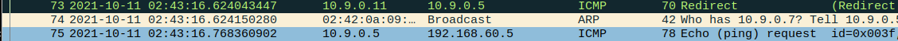

ICMP Redirect Attack Lab
-------------------------

This lab is about creating ICMP redirect. Which is an error message sent by a router to the sender of an IP packet. Redirects are used when a router believes a packet is being routed incorrectly, and it would like to inform the sender that it should use a different router for the subsequent packets sent to that same destination. ICMP redirect can be used by attackers to change a victim's routing.

The objective of this task is to launch an ICMP redirect attack on the victim, such that when the victim sends packets to 192.168.60.5, it will use the malicious router container (10.9.0.111) as its router. Since the malicious router is controlled by the attacker, the attacker can intercept the packets, make changes, and then send the modified packets out. 


## Environment Setup using container
-------------------------------------

As with the other labs we will be using the SEED docker containers in the zip file provided for the lab. Make sure to shut down any other containers that might be running on your lab machine or just start the configuration from a fresh VM. The details for Environment setup can be found on [SEED labs](https://seedsecuritylabs.org/Labs_20.04/Networking/ICMP_Redirect/)

Once the environment is set up, verify that it represents the one SEED wants you to use in the lab.


## Task 1: Launching ICMP Redirect Attack

In the Ubuntu OS there is a countermeasure against ICMP redirect attacks. The Containers have been configured to ignore this countermeasure such that the victim will accept redirect messages.

We will attack the Victim container from the Attacker container. Checking the routing on our victim container


We see that the Victim container uses the container router to get to the 192.168.60.0/24 network.

Now we will develop a scapy script to Launch an ICMP redirect, icmpredirect.py
```python
#!/usr/bin/python3
from scapy.all import *

## THE SOURCE IS THE DEFAULT GATEWAY, THE DESTINATION OUR VICTIM MACHINE
ip = IP(src = '10.9.0.11', dst ='10.9.0.5')
# type 5 is redirect, code 1 is for host
icmp = ICMP(type=5, code=1)
## OUR REDIRECT MESSAGE CONTAINS A NEW GATEWAY FOR THE VICTIM MACHINE TO USE
icmp.gw = '10.9.0.111'
# The enclosed IP packet should be the one that
# triggers the redirect message.
## THIS IS THE SPOOFED ICMP THAT TRIGGERED OUR DEFAULT GATEWAY TO SEND THE
## REDIRECT MESSAGE.
ip2 = IP(src = '10.9.0.5', dst = '192.168.60.5')
send(ip/icmp/ip2/ICMP())
``` 
 
In order to simulate a man in the middle attack on the same subnet we need to spoof an ICMP redirect message that will identify our malicious router as the gateway for the victim machine to use when sending traffic to a machine on a different subnet.

#####**NOTE**
There is a peculiar issue in the containers mentioned in the [lab documents](https://seedsecuritylabs.org/Labs_20.04/Files/ICMP_Redirect/ICMP_Redirect.pdf) that require the victim container to be pinging the destination while you run the attack. Not sure why this is the author points out that this is only an issue while running this attack on containers.

#### **Verification**
So while running a ping to a machine on the subnet that 10.9.0.11 is a gateway for we run the attack on the attacker container and are able to get the ICMP redirect to store our malicious router in its routing cache for traffic destined for 192.168.60.5 machine. running 'mtr -n 192.168.60.5' will show a traceroute program documenting the re-routed traffic


We can also show the routing cache with the command 'ip route show cache'


#### **Questions**

#####1. Can we use ICMP redirect attacks to redirect to a remote machine?
No. ICMP redirect does not redirect traffic to a remote machine, this is because a remote machine would require the packets to be first sent through a gateway to a machine off the network. Since a remote machine is not on the same internet segment (subnet), ARP will be used to determine if that route is indeed on the same subnet. When it can't find the remote machine then the redirect address is not stored in the routing cache. RFC 1222 section 3.2.2.2 defines that redirect messages require the host to update its routing table. So when the host machine tries to update its routing table it uses ARP to search for the remote machine on its segment, this fails and the redirect address is not stored. To test this I used the same icmpredirect.py, but changed the ICMP type 5 code 1 gateway message to be a remote machine (My university's student server). See icmpremote.py. I was then able to observe with wireshark the host machine searching for the remote server to redirect traffic to, this ARP request was not fulfilled so the routing of the host does not update.

Wireshark showing ARP request to remote machine:


#####2. Can we use ICMP redirect attacks to redirect traffic to a non-existing machine on the same network segment?

We will try to redirect packets to a non-existant machine on the same network segment as our victim. Changing the gateway destination (icmp.gw) to a non-existant machine on the same network results in the same result as trying to change the value of the gateway to a remote machine. The redirect is taken be the host which then tries to update its routing table by sending an ARP request for the specified address. The address does not exist, so the routing is not updated. See icmpnonexist.py for the ip address I tested with.



#####3. Looking at the docker-compose.yml file we can see the redirect configuration for our malicious router is set to 0 in all respects, meaning that our router will not send ICMP redirect messages out. We can change the values and relaunch our successful attack from task 1 to see why.

First we edit the sysctl entries in the docker-compose file, then we need to build the container network again, run icmpredirect.py on the attacker machine then observe the traffic with wireshark. Turning these vaulues to 1 will allow our malicious router to send out redirect packets, which it then does since it has found a more direct route for the traffic coming from the victim's machine, this negates our whole attack!


We can see in this wireshark capture that the host receives the first redirect, sends a packet out on the redirected route, to which our malicious router responds with a redirect route back to the original gateway.

#Task 2 Launching the MITM Attack
-------------------------------------

In order to launch a MITM attack with our current container configurations. We must turn off port forwarding from our malicious router in order to intercept and modify packets from the victim's machine. We do this in the docker compose config file. On the line `# sysctl net.ipv4.ip_forward=0`. 

Next we need to redirect traffic from the victim machine using icmpredirect.py. Now when any transmissions are made through our router, no traffic leaves the network segment because port forwarding is off.

We are provided by SEED labs a sample python code to intitiate our MITM attack such that we intercept packets from the victim's machine and modify them. This requires us to filter for packets with a source addresss matching our victim, then we parse the payload of a nc session (TCP), replace my name 'keith' with 'AAAAA' in the payload, then forward the modified packet to the original destination (192.168.60.5). 


**NOTE** The sample code provided gives us a challenge to modify the filter so that we are only retransmitting our intercepted packets and not ALL packets on the interface of the router. So we use the BPF filter expression in the scapy sniff() function `"tcp and src host 10.9.0.5"`. Filtering this way ensures we are only forwarding tcp packets from our intended victim's machine.

###Questions

#####4. In the MITM program you only need to capture traffic in one direction. Which direction and why?

Traffic needs to be captured from the victim's machine ONLY and to the specific destination that we have set up the ICMP redirect for. This needs to be the case because the ICMP redirect only functions in that direction from host to destination. The gateway coming back from the destination 192.168.60.5 will know how to route back to 10.9.0.5 without sending traffic through our malicious router because the routing table on the default gateway has not changed, only the routing from the victim to the destination has changed from the ICMP redirect.

#####5. What is better to choose? The IP address or the MAC address.
 
