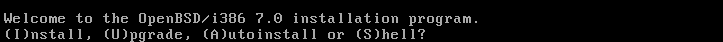
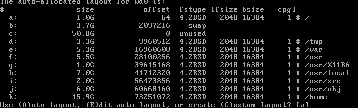
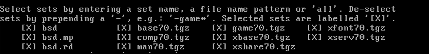
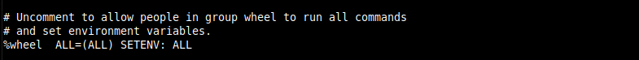
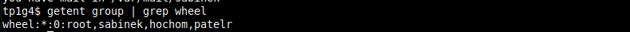
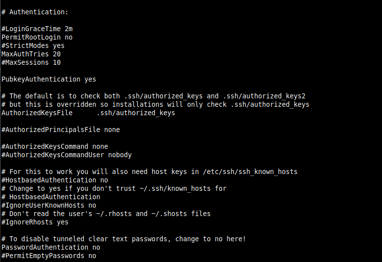
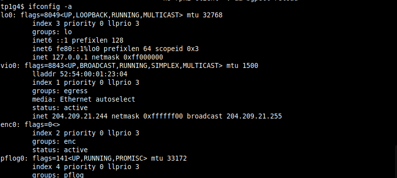
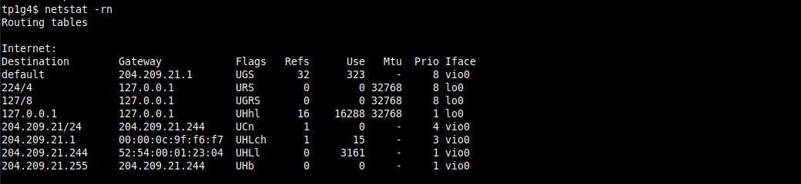
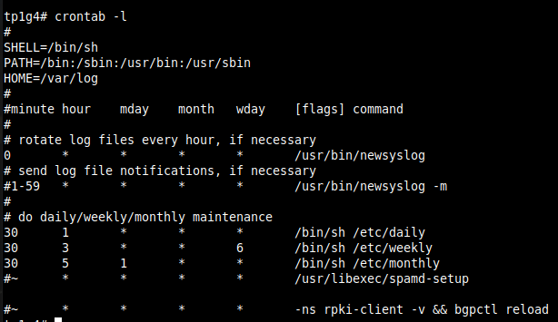
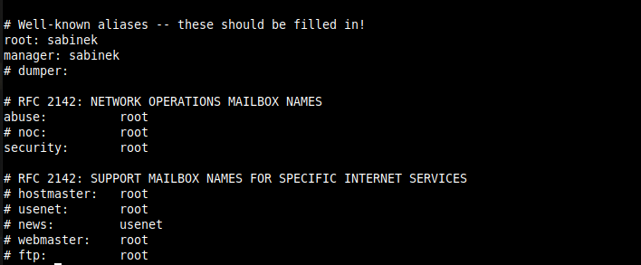

# REPORT C380 TERM PROJECT 1
-----------------------------------------------------
In this term project we have been tasked with setting up and securing a linux/unix server machine. Our group chose to go with implementing a mail server on the openBSD operating system. We chose openBSD because the operating system is designed with proactive security as its number one design decision. OpenBSD is an operating system that is shipped "secure by default" and when we install the operating system we see that all non-essential services to the machine running are disabled. This forces the administrators of the system to carefully consider implications of enabling a new service or daemon as they will need to be configured to suit the system manually by an administrator.

The following report will detail, step-by-step, our process of setting up the mail server with openBSD from the start and the steps we took along the way to secure the system.

## System Setup and Installation
------------------------------------------------------

We aquired the iso file from the openBSD website.[openBSD](https://www.openbsd.org/faq/faq4.html#Download). Since it is a disk image we can not cryptographically verify it. We have to trust that the image we downloaded from openBSD.org is not in fact a rogue installation file. We are reasonably sure that this is not a rogue installation. The file was taken from [install70.iso](https://cdn.openbsd.org/pub/OpenBSD/7.0/i386/install70.iso).

According to the specifications of the assignment we create the VM with the maximum amount of resources we are allowed (4 cpus, 4GB of RAM, and 60gb of disk space). We load the ISO image to the VM so it has the installation available on first boot.

The machine boots up and we are greeted with the openBSD installation page



Following the on screen instructions we install the system with the following options:

	- Choose Install
	- Choose US keyboard layout
	- System hostname: tp1g4 (anagram for term project 1 group 4)
	- Network interfaces: vi0
		-IPv4 		204.209.21.244
		-Gateway: 	204.209.21.1
		-DNS:		10.62.8.10
		-DNS Hostname:  test4.cs.macewan.ca
	- password for root account (Entered a password that was changed later)
	- start sshd by default:	yes
	- X window system:		no
	- Setup a user:			sabinek
	- Allow root ssh login:		yes (needs to change later)
	- Set timezone:			Canada/Mountain
	- Set Root Disk			hd0
	- Use Whole disk for MBR
	- Review layout of hd0:



	- Use the Auto Layout
	- Install all filesets



	- No SHA256 sig: I addressed this in the introduction, we used an ISO image for install, the sha256 sig could have been modified by an attacker if this was a malicious ISO file. (it is not).

	
It is a neccessary evil to allow root login temporarily by SSH in order to configure our machine with user accounts for the group and allow them to have access via ssh.

We reboot the machine and begin the System configuration. OpenBSD greets the new user with a banner message encouraging users of the operating system to report any bugs and also informs the root user that they have mail. This mail is important to read for a system administrator who wants to know more about the system they are installing.

We learn here that openBSD has centralized its system configurations in the /etc directory. Also to read the manual for afterboot. 

The afterboot manpage contains lots of information for the administrator to consider. The first of which is to run syspatch, since the packages included in the ISO file may be out of date by the time we have downloaded the file, we run this to patch the system with the latest security updates. Once the security updates are installed I can log out from the vnet virtual machine and begin to configure the system over SSH. [Source](https://man.openbsd.org/afterboot)

The first thing to do with the new system is to add my group members as users. To do this I run the command
`useradd -g <lastnamefirstinitial>` the -g option creates a home directory for each user. We also need to set passwords for our users with the `passwd <username>` command. I set temporary passwords for my team so that they can change them to a password I will not know.

By default openBSD uses the doas command to allow users to execute root commands, we have opted to install the sudo package instead because it is more familiar to our users. So we add the Sudo package with:

`pkg_add sudo`

Once the package is installed we can edit the sudoers file by running the command visudo. By uncommenting the line below:



we ensure that users of the Wheel group can use sudo. The command visudo ensures that your sudo file is not configured with any syntax errors when you write it. So it is obvious if any errors are made at this step.

Now we add our created users to the Wheel group to allow them to administer the system from their own accounts. The following command was used to append our users to the wheel group.

`usermod -G wheel <lastnamefirstinitial>`

And we can verify it by grep-ing the group file



#### Security Feature
Now that we have our administrative user accounts set up it is important to disable the root login completely. It is no longer needed and we do not want to risk root actions being without any accountability. The sudo command allows for any command to be logged under /var/log/secure when executed with sudo so we can track what commands have been executed with elevated privileges.

Before we disable the account completely though we configure the ssh daemon and lock it down against any brute force attacks, since this machine will be facing the internet a first point of attack could be the ssh credentials. So what we will do is edit the sshd_conf located in /etc/ssh directory.



This is a partial screenshot of the SSHD configuration file. The lines we have changed from the intial set up are:
	-`PermitRootLogin no`
	-'PasswordAuthentication no`
We have changed these settings such that we will only allow users to connect via ssh using ssh PKI. I have added public ssh keys to our user accounts on the system under their /home/<username>/.ssh/authorized_keys files. This means that connections to the machine will only be allowed if the user has the private key on their machine that matches the public key stored on our server machine.

We now have SSHD configured as we want it we can restart the service with `rcctl restart sshd` and our changes should be applied immediately.

#### Continuing with afterboot:

We have configured the logins for the machine so we can continue going through the afterboot checklist. The next item after login is the Root password, we have already changed this. Next we confirm that the time is correct. The time has been set correctly so we can move on.

##### Checking our hostname:
Our hostname is tp1g4.test4.cs.macewan.ca: This is correct

Checking our network interface config and routing tables:





Everything seems correct here.

##### Mail:

This is the system mailer, not to be confused with the mail server to be set up later on in the report. It handles mailing out system information using smtpd. We will need to modify the smtpd.conf later.

Daily, weekly, monthly scripts:

These are run daily on the openBSD system to check integrity and modification of files. It is not an absolute IDS but it will mail the admin under the /etc/mail/aliases file with its contents. The scripts are being run by default as a cron job and can be viewed with `crontab -l` as root.



These daily/monthly reports are mailed to the root@hostname, which is defined in the /etc/mail/aliases file



As you can see I have directed all mail to the sabinek account so I can be notified of system file changes.

##### Checking Disk mounts:

OpenBSD, by default, mounts each main directory off root to its own partition, this is for security purposes. We can change which are writable/readable easily without affecting the other systems on the machine. We can also easily allocate space allowed to be used for each partition. Since we are creating a mail server we will implement them in such a way that if the mail server stores so much data it will not bring the system down due to full disk usage.


#### Security feature IDS Script Implemented by Rudra Patel

A feature that was created for server security is the IDS (Intrusion Detection System). Although OpenBSD natively has a feature to check for any changes for files and permissions, we have created an IDS that checks specific directories relating to the server files, client, and logs. The script made for the IDS was adapted from [Calomel](https://calomel.org/ids_mtree.html) in the mtree section, Calomel is an open-source research and reference site.
Now I will go into how the script works. In the bash script I created a new directory /etc/ids which contains all files relating to the IDS, this will include the bash script and all the hash files for each directory the IDS will monitor.

Located in /etc/ids here is the script:

```bash
#!/usr/local/bin/bash

if [ $# -eq 0 ]
   then
    echo "Usage:"
    echo "./ids.sh $arg"
    echo "--------------------"
    echo "$arg:"
    echo "gen = generate the IDS signatures"
    echo "verify = verify files with generated signatures"
   exit
 fi

MTREE=mtree

## IDS signature key
KEY=49650315872068453716825

## IDS signature directory
DIR=/etc/ids

if [ $1 = "gen" ]
   then
     rm -rf $DIR/mtree_*
     cd $DIR
     $MTREE -c -K cksum,md5digest,sha1digest,sha256digest -s $KEY -p /bin > mtree_bin
     $MTREE -c -K cksum,md5digest,sha1digest,sha256digest -s $KEY -p /etc > mtree_etc
     $MTREE -c -K cksum,md5digest,sha1digest,sha256digest -s $KEY -p /var/vmail/test4.cs.macewan.ca > mtree_vmail
     $MTREE -c -K cksum,md5digest,sha1digest,sha256digest -s $KEY -p /sbin > mtree_sbin
     $MTREE -c -K cksum,md5digest,sha1digest,sha256digest -s $KEY -p /var/www > mtree_www
     logger generate IDS signatures
     chmod 600 $DIR/mtree_*
   exit
 fi

if [ $1 = "verify" ]
   then
     cd $DIR 
     $MTREE -s $KEY -p /bin < mtree_bin >> temp 2>&1
     $MTREE -s $KEY -p /etc < mtree_etc >> temp 2>&1
     $MTREE -s $KEY -p /var/vmail/test4.cs.macewan.ca < mtree_vmail >> temp 2>&1
     $MTREE -s $KEY -p /sbin < mtree_sbin >> temp 2>&1
     $MTREE -s $KEY -p /var/www < mtree_www >> temp 2>&1
     cat temp | mail -s "`hostname` file integrity check" sabinek patelr hochom
     rm temp
     logger verify file integrity against IDS signatures
   exit                                                                         
 fi
```

Following the instructions from Calomel’s site, the IDS uses the mtree utility to check for file changes. To help the user with using the script, I’ve added usage instructions like how you would see in the terminal for other commands. So, if the user doesn’t specify which operation to perform and just enter “./ids.sh”, the script would display the usage information. To generate the hashes, enter “./ids.sh gen”, and to verify the files, “./ids.sh verify”.

When the user performs the hash generation operation, the script, will remove all old hash generated files if any then it will generate the checksums and hash digests of the specified directories with the seed key that was set before, and output the hashes to a file.

The reason we have so many hashing digests, is in case the checksum and/or and other digest was compromised, then the system could still check the hashes of the other few digests included, providing layers of multiple hashes and stronger security. The operation would then be logged in the system log. And change permissions of the hash files to root, because the hash checks in verification operation will be checked against these files.
If the user instead wishes to verify the integrity of the files, the script would take input from the generated digests and recompute the hashes and append the output to “temp” and also redirect the stderr to temp, which would include any modification details since last hash generation so the user would know if the files have been changed or not.

Finally, the script will send the verification report in “temp” to all root accounts. When the mail is sent to the root accounts, if the directories that we are monitoring where to have changes, the report will display the path of the directory that changed, modification time and the changed checksum value, however if there are no changes, the report will only include the checksum values and the directory paths. Before exiting, the script will remove the “temp” file and log the operation in system log.


#### End of OpenBSD Installation and System Configuration

These were the steps we took to secure our operating system and implement some features of our own. The openBSD operating system comes with many security features enabled, some of which have been detailed here.

## Application installation, configuration, and hardening
-----------------------------------------------------------------------

In order to implement the mailserver we will use openSMTP, dovecot, and rspamd. To make use of the mailserver we will also install the web application Rainloop. Following is a step by step report on how we installed and configured each package.

#### Errata concerning Mail

In order to implement a Mail Server that WORKS with a web mail client we need to ensure that the DNS records are correct for our server. Without a proper DNS configuration pointing to our server we will not be able to send or receive mail. Also a DNS configuration pointing to our mail server is needed to implement DKIM, DMARC, and SPF.

Side note: this portion of the project seems like it would work well in a network security course. Since we spent a week+ talking about Mail.

It is completely possible for us to set up these mechanisms, but we would need to be able to access the domain records and edit the TXT records in order to enable these mechanisms which will allow us to have a functioning mail server that will be able to send and receive emails.

If we are not able to implement DKIM we will not be able to verify that our Mail Server is sending messages, which means our mail server could be impersonated by a malicious machine and send mail on our behalf. Not to mention most other mail servers will reject any messages being sent from a domain with no DKIM, depending on their DMARC policy.
[SOURCE](https://datatracker.ietf.org/doc/html/rfc4686)

The same is true for our Server, we need to be able to verify any Domain that is sending mail to our server and we need to apply a DMARC policy to incoming mail. As an ongoing investigation into the security of our server we need to be able to review feedback of DMARC reports in order to ensure our server is sending mail correctly.

We also need to have a TLS certificate in place to ensure our mail cannot be modified in transit, I cannot generate a free certificate of our domain if there is no record for our domain existing.

For a proof of concept mail server we have generated a TLS certificate that is self signed, this is to make sure we can use HTTPS on the web application, and sign our mail traffic.

What we would need in order to make this a functioning mail server are the following records in DNS:
```
#  Ideal entries for DNS test4.cs.macewan.ca
MX record

# SPF
test4.cs.macewan.ca.	IN TXT	"v=spf1 mx -all"

# DKIM
20220209._domainkey.test4.cs.macewan.ca.	IN TXT	"v=DKIM1;k=rsa;p=MIGfMA0GCSqGSIb3DQEBAQUAA4GNADCBiQKBgQCo5SWGMLzpl5oHjsFPGkVjnVVjes7oVISYFZcPhyHva81N3WS3uM5NcrO5ePn+mfJrs0hcU51b7zctKUZ8JlvEDV8s7sQ6O0Le6vLf7ydW3Ru49qr7sE9jPWX/dNX7Tbc6mfkrDEJo8kyFUgnBsAcf/QIcPWmasprtZa5f8UFPLQIDAQAB;"


# DMARC
_dmarc.test4.cs.macewan.ca.	IN TXT	"v=DMARC1;p=none;pct=100;rua=mailto:postmaster@test4.cs.macewan.ca
```

### OpenSMTP

The following file is located in /etc/mail/smtpd.conf and is responsible for configuring the smtp daemon.

```
#	$OpenBSD: smtpd.conf,v 1.14 2019/11/26 20:14:38 gilles Exp $

# This is the smtpd server system-wide configuration file.
# See smtpd.conf(5) for more information.

pki test4.cs.macewan.ca cert "/etc/ssl/test4mail.crt"
pki test4.cs.macewan.ca key "/etc/ssl/private/test4mail.key"

filter rspamd proc-exec "filter-rspamd"

table aliases file:/etc/mail/aliases
table credentials passwd:/etc/mail/credentials
table virtuals file:/etc/mail/virtuals


listen on all tls pki test4.cs.macewan.ca\
	filter { rspamd }

listen on all port submission tls-require pki test4.cs.macewan.ca auth <credentials> filter rspamd

action "local_mail" mbox alias <aliases>
action "domain_mail" maildir "/var/vmail/test4.cs.macewan.ca/%{dest.user:lowercase}" virtual <virtuals>
action "outbound" relay helo test4.cs.macewan.ca

# Uncomment the following to accept external mail for domain "example.org"
#
match from any for domain "test4.cs.macewan.ca" action "domain_mail"
match from local for local action "local_mail"

match from any auth for any action "outbound"
match for any action "outbound"
```

The first two lines regarding `pki` point to where our ssl certificates are being stored on the system. These certificates are self-signed, as we had no control over our domain and the DNS records this was required to get mail functioning, at least locally.

The filter line points to the rspamd application and how we are going to filter our mail. This will be elaborated on later, but for now just understand that it is responsible for filtering incoming mail.

The table points to 3 different files on the machine, aliases, credentials, and virtuals. Aliases are responsible for local system mail and will deliver system reports to the users on the system, this is not outgoing or incoming mail. The `credentials` file is the passwd database of which our virtual users are stored. The `virtuals` table is a list of virtual users on our mail system.

The `listen on` lines tells the smtp daemon to listen for all tls traffic and points it to our rspamd filter. The second line requires that any mail submitted to the SMTP daemon for sending is signed by our tls certificate and backed up by an authorized virtual user of our mail server.

The `action` lines define actions that the smtp daemon will take. local_mail follows addresses from the `aliases` file, domain_mail defines the directory in which virtual user's mail is delivered to with some string formatting to determine each user's directory, if the directory does not exist the smtp daemon will create it based on the `virtuals` table of virtual users. The outbound action determines what the smtp daemon will do with outgoing mail.

The `match from/for` lines do exactly what you might expect, it tells the smtp daemon how to match specific traffic with a specific action as defined above.

##### Security Feature: Set credentials to read-only for _smtpd and _dovecot system users.

We don't want any system user to be able to read our virtual mail credentials as they are private. So we set them to only be readable by the packages that require them. Namely OpenSMTP and Dovecot.

### Dovecot

In order for users to be able to interact with their mail in a human readable way we need to configure a IMAP and POP3 server, and Dovecot can achieve this for us. Following is our local.conf for dovecot. located in /etc/dovecot/local.conf

```
auth_mechanisms = plain
first_valid_uid = 2000
first_valid_gid = 2000
mail_location = maildir:/var/vmail/%d/%n
mail_plugin_dir = /usr/local/lib/dovecot
managesieve_notify_capability = mailto
managesieve_sieve_capability = fileinto reject envelope encoded-character vacation subaddress comparator-i;ascii-numeric relational regex  imap4flags copy include variables body enotify environment mailbox date index ihave duplicate mime foreverypart extracttext imapsieve vnd.dovecot.imapsieve
mbox_write_locks = fcntl
mmap_disable = yes
namespace inbox {
	inbox = yes
	location =
	mailbox Archive {
		auto = subscribe
		special_use = \Archive
	}
	mailbox Drafts {
		auto = subscribe
		special_use = \Drafts
	}
	mailbox Junk {
		auto = subscribe
		special_use = \Junk
	}
	mailbox Sent {
		auto = subscribe
		special_use = \Sent
	}
	mailbox Trash {
		auto = subscribe
		special_use = \Trash
	}
	prefix =
}
passdb {
	args = scheme=CRYPT username_format=%u /etc/mail/credentials
	driver = passwd-file
	name =
}
plugin {
	imapsieve_mailbox1_before = file:/usr/local/lib/dovecot/sieve/report-spam.sieve
  	imapsieve_mailbox1_causes = COPY
  	imapsieve_mailbox1_name = Junk
  	imapsieve_mailbox2_before = file:/usr/local/lib/dovecot/sieve/report-ham.sieve
  	imapsieve_mailbox2_causes = COPY
  	imapsieve_mailbox2_from = Junk
  	imapsieve_mailbox2_name = *
  	sieve = file:~/sieve;active=~/.dovecot.sieve
  	sieve_global_extensions = +vnd.dovecot.pipe +vnd.dovecot.environment
  	sieve_pipe_bin_dir = /usr/local/lib/dovecot/sieve
  	sieve_plugins = sieve_imapsieve sieve_extprograms
}

protocols = imap sieve
service imap-login {
	inet_listener imap {
	port = 0
	}
}
service managesieve-login {
	inet_listener sieve {
		port = 4190
	}
  	inet_listener sieve_deprecated {
  	port = 2000
  	}
}
ssl_cert = </etc/ssl/test4mail.crt
ssl_key = </etc/ssl/private/test4mail.key
userdb {
	args = username_format=%u /etc/mail/credentials
	driver = passwd-file
	name =
}

protocol imap {
  mail_plugins = " imap_sieve"
}

``` 

In this configuration file we set up the configuration for our IMAP and POP3 server. The first line:
`auth mechanisms` defines which authentication mechanisms we wish to use: here we supply it with plain because we have the login credentials set up per-user. 

`first_valid_uid/gid = 2000` -- This defines the system user we have assigned to handle the virtual users our mail client will handle.

`mail_location` defines the directory in which users' mail will be stored on the system.

`mail_plugin_dir` defines where the various plugins we will use with dovecot are installed on the system.

`managesieve_notify_capability` and `managesieve_sieve_capability` defines where any sieve notifications are sent to and what information the sieve service receives before any authentication is performed. This is part of the pigeonhole plugin.

`mbox_write_locks` this line specifies we will use fnctl to control locking files when writing to them.

`mmap_disable` this disables the mmap functionality in which files are mapped into memory [Source](https://man7.org/linux/man-pages/man2/mmap.2.html)

`namespace inbox` this defines the inbox view users will have when accessing their mail, included here are Inbox, Archive, Drafts, Junk, Sent, and Trash

`passdb` here we have specified the credentials file we defined in the smtpd.conf, it is where the credentials for our virtual users are found.

`plugin` this defines the plugin we are using, namely the pigeonhole plugin. This configuration uses a reporting script written which determines if incoming mail is junk o rnot

`protocols` this determines the protocols we will be using with dovecot: imap for user login and sieve.

`ssl_*` this defines for dovecot where our self signed certificate is stored.

`userdb` we define the user database for our system, also assign to it a driver. We are using the passwd file configuration for our virtual mail users.

Some additional configuration steps were also taken for dovecot in the /etc/login.conf file in order to facilitate it being able to open and read many files at once.

```
#
# Package specific classes
#
dovecot:\
	:openfiles-cur=1024:\
	:openfiles-max=2048:\
	:tc=daemon:
```

In order to make use of rspamd we create scripts to handle spam and ham, for our mail server simply moving maill into and out of the junk folder will trigger an event in which rspamd responds to:

in report-ham.sieve:
```
require ["vnd.dovecot.pipe", "copy", "imapsieve", "environment", "variables"];

if environment :matches "imap.mailbox" "*" {
  set "mailbox" "${1}";
}

if string "${mailbox}" "Trash" {
  stop;
}

if environment :matches "imap.user" "*" {
  set "username" "${1}";
}

pipe :copy "sa-learn-ham.sh" [ "${username}" ];
```

and report-spam.sieve
```
require ["vnd.dovecot.pipe", "copy", "imapsieve", "environment", "variables"];

if environment :matches "imap.user" "*" {
  set "username" "${1}";
}

pipe :copy "sa-learn-spam.sh" [ "${username}" ];
```

These scripts are compled with sievec and moved to `/usr/local/lib/dovecot/sieve`

and in order to implement the scripts we need to write two shell scripts: sa-learn-ham.sh and sa-learn-spam.sh which simply call exec on rspamc with an argument and the sieve script name:

```
#!/bin/sh
exec /usr/local/bin/rspamc -d "${1}" learn_ham

#!/bin/sh
exec /usr/local/bin/rspamc -d "${1}" learn_spam
```

### rspamd

The final package we need to configure to get mail working properly is rspamd which is a open source spam filtering system for mail, but it also has many other features It provides dkim signing, antivirus integration, and a lot of different modules you can use to fine tune a mail server setup. We have rspamd congiured to handle DKIM-signing and spam filtering features as defined in this article. [SOURCE](https://poolp.org/posts/2019-09-14/setting-up-a-mail-server-with-opensmtpd-dovecot-and-rspamd/)

The only configuration we need to look at is how to sign our mail for DKIM. Unfortunately this feature will not work unless we have control of DNS records, so for now rspamd is just handled when dovecot calls its filtering sieves.

### Rainloop webmail client

In order to configure a web client we use the HTTP daemon httpd to handle https requests coming to our server. Here is our configuration file located at `/etc/httpd.conf`

```
server "test4.cs.macewan.ca" {
        listen on * tls port 443
        tls {
                certificate "/etc/ssl/test4mail.crt"
                key "/etc/ssl/private/test4mail.key"
        }
        log {
                access  "test4.cs.macewan.ca-access.log"
                error   "test4.cs.macewan.ca-error.log" 
        }

        root "/rainloop"
        directory index index.php

        # security
        location "*/.git*"      { block }
        ## app specific
        location "/data/*"      { block }
        # robots.txt
        location "/robots.txt"  { pass }

        location "/*.php" {
                fastcgi socket "/run/php-fpm.sock"
        }
}
```

As we can see it is accessing the rainloop application directory when test4.cs.macewan.ca is requested. It will return the request using our self-signed certificate. Once the rainloop package is running and we restart the httpd daemon we can navigate to the portal and access webmail of the users we have created.
