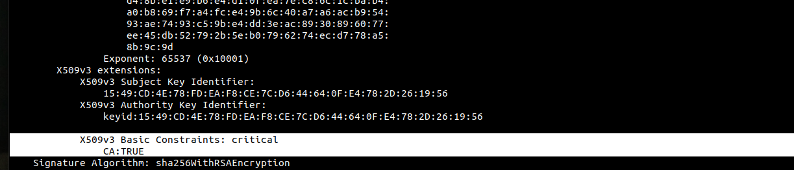
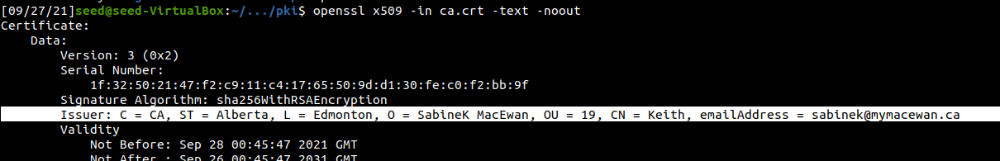
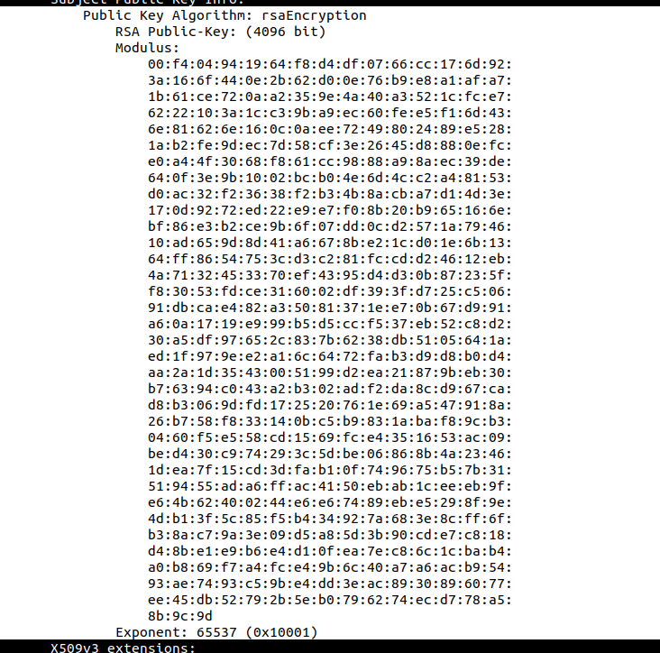
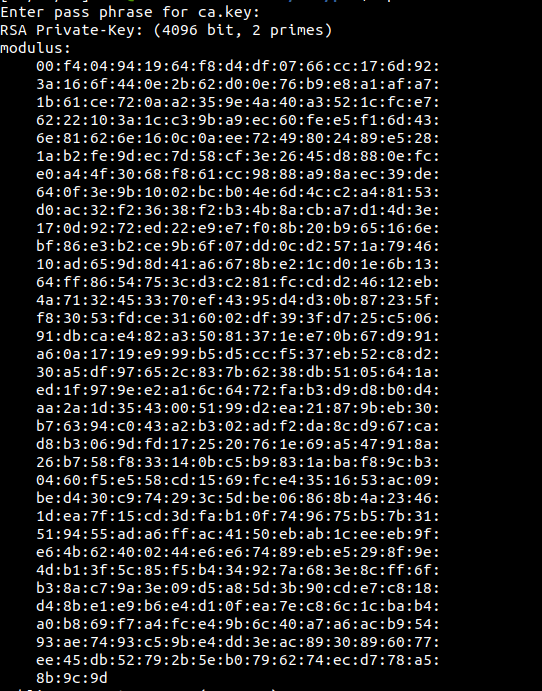

PUBLIC KEY INFRASTRUCTURE LAB
------------------------------

#### Intro

My name is Keith Sabine and I will be working through this SEED security lab as part of my Undergrad CS studies.

#### Some Notes
All of the machine configurations are available on the SEED website.[PKI LAB](https://seedsecuritylabs.org/Labs_20.04/Crypto/Crypto_PKI/). I will only be posting my progress and observations as I work through the lab and answer the questions it requires. I set up the SEED VM using the Ubuntu 20.04 VM config. I will be completing both Tasks 1 through 5.

#### Lab Environment
Download the Labsetup.zip from the [PKI LAB](https://seedsecuritylabs.org/Labs_20.04/Crypto/Crypto_PKI/) and run the `dcbuild` alias followed by the `dcup` to get your containers running for the lab. For this lab run the tasks on the VM, but use the container to host the apache web server. We also need to edit in a couple entries to the /etc/hosts folder on the VM.

### LAB TASKS
#### 3.1 Task 1: Becoming a Certificate Authority
---------------------------------------------------
We need to generate a self-signed certificate.

```
openssl req -x509 -newkey rsa:4096 -sha256 -days 3650 \
-keyout ca.key -out ca.crt
```
Next we need to generate two files.

index.txt --- An empty text file

serial --- Stores a number

This command generates the ca.key and ca.crt file. The private key for our CA (ca.key) and the public key certificate (ca.crt).

Additional commands can be used to generate the information openssl req will prompt for.

Taking a look at the X.509 certification we generated we can see the different fields of it.
The version number, Serial number, Signature algortihm ID, Issuer name, Validity period (not before, not after) Subject name, Subject public key information( the algorithm for public key and the Subject public key), The issuer unique identifier, the subject unique Identifier, the extensions, the Certificate Signature algorithm, and finally the certificate signature. 

In version 3 of X.509 the extension was added Basic Constraints. This field specifies whether the entity can be used as a CA and, if so, the number of subordinate CAs that can exist beneath it in the certificate chain.

Here we can see the constraints of our certificate. Which is as a CA.



We know that this certificate is self signed by looking at the issuer field of the certificat



Identifying the values in the certificate file:

We have the Modulus of the RSA algorithm in our certificate file as well as the public exponent stored. This is the 'n' value and the 'e' value respectively.


If we want to get more information we need to access the the password protected key file. This will give us the rest of the values needed to perform the RSA encryption algortihm

n the modulo value calculated by multiplying two primes p and q:



We can find p and q under the prime1 and prime2 fields:


Our public and private exponents are the values e, and d respectively:


### Task 2: Generating a Certificate Request for your Web Server
------------------------------------------------------------------


