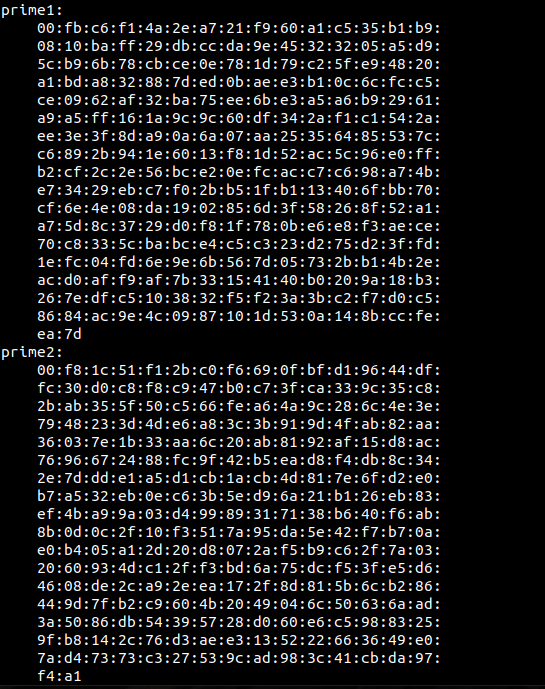
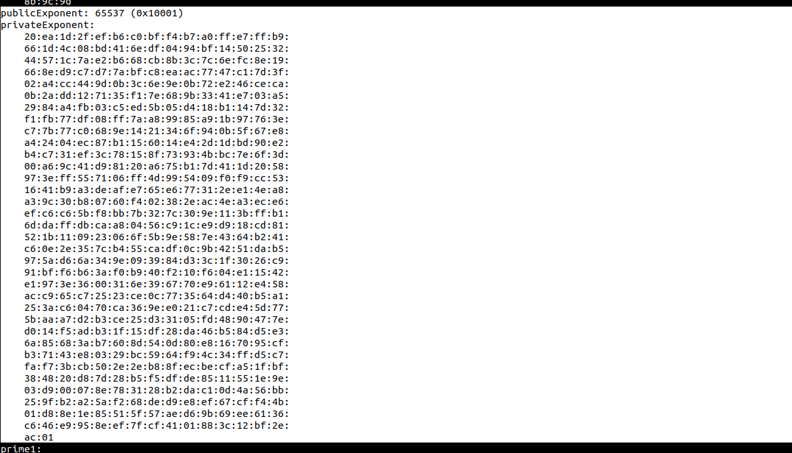
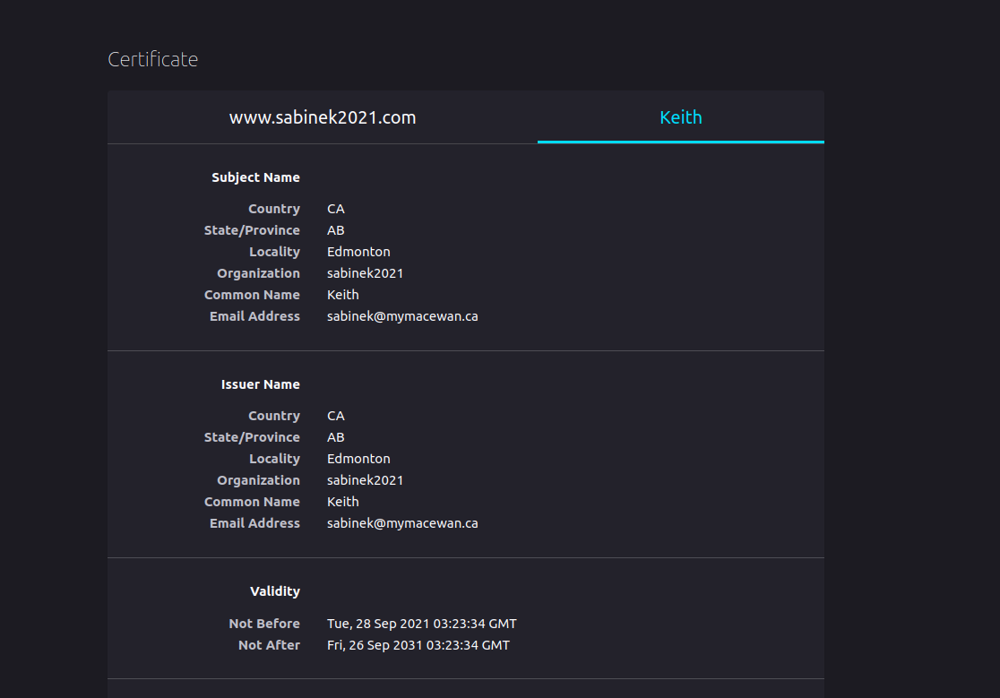

PUBLIC KEY INFRASTRUCTURE LAB
------------------------------

#### Intro

My name is Keith Sabine and I will be working through this SEED security lab as part of my Undergrad CS studies.

#### Some Notes
All of the machine configurations are available on the SEED website.[PKI LAB](https://seedsecuritylabs.org/Labs_20.04/Crypto/Crypto_PKI/). I will only be posting my progress and observations as I work through the lab and answer the questions it requires. I set up the SEED VM using the Ubuntu 20.04 VM config. I will be completing both Tasks 1 through 5.

#### Lab Environment
Download the Labsetup.zip from the [PKI LAB](https://seedsecuritylabs.org/Labs_20.04/Crypto/Crypto_PKI/) and run the `dcbuild` alias followed by the `dcup` to get your containers running for the lab. For this lab run the tasks on the VM, but use the container to host the apache web server. We also need to edit in a couple entries to the /etc/hosts folder on the VM.

### LAB TASKS

***NOTE*** For the lab we will need to make sure our VM has the correct DNS entry for the name of the website we are creating on our webserver otherwise we won't be able to connect. I added in the example website as well as the one we will be creating. This will be in the /etc/hosts file on your Ubuntu VM.

```
10.9.0.80 www.bank32.com
10.9.0.80 www.sabinek2021.com
```

#### 3.1 Task 1: Becoming a Certificate Authority
---------------------------------------------------
We need to generate a self-signed certificate.

```
openssl req -x509 -newkey rsa:4096 -sha256 -days 3650 \
-keyout ca.key -out ca.crt
```
Next we need to generate two files.

index.txt --- An empty text file

serial --- Stores a number

This command generates the ca.key and ca.crt file. The private key for our CA (ca.key) and the public key certificate (ca.crt).

Additional commands can be used to generate the information openssl req will prompt for.

Taking a look at the X.509 certification we generated we can see the different fields of it.
The version number, Serial number, Signature algortihm ID, Issuer name, Validity period (not before, not after) Subject name, Subject public key information( the algorithm for public key and the Subject public key), The issuer unique identifier, the subject unique Identifier, the extensions, the Certificate Signature algorithm, and finally the certificate signature. 

In version 3 of X.509 the extension was added Basic Constraints. This field specifies whether the entity can be used as a CA and, if so, the number of subordinate CAs that can exist beneath it in the certificate chain.

Here we can see the constraints of our certificate. Which is as a CA.


We know that this certificate is self signed by looking at the issuer field of the certificate


Identifying the values in the certificate file:

We have the Modulus of the RSA algorithm in our certificate file as well as the public exponent stored. This is the 'n' value and the 'e' value respectivelying the `openssl rsa -in ca.key -text -noout`


If we want to get more information we need to access the the password protected key file. This will give us the rest of the values needed to perform the RSA encryption algortihm

n the modulo value calculated by multiplying two primes p and q:


We can find p and q under the prime1 and prime2 fields:



Our public and private exponents are the values e, and d respectively:



### Task 2: Generating a Certificate Request for your Web Server
------------------------------------------------------------------

We are going to create a webserver called sabinek2021. We need to get a public-key certificate from our newly made CA. We will need to generate a Certificate Signing Request, which includes the company's name and information, send the request to the CA which will verify the identity information of the request and grant a certificate.

I ran this command to generate the key of my sabinek2021 webserver, the lab instructs us further to add in some alternative domains to be accepted with the same certificate so I will add in the `-addext "subject AltName = [Names]':

```
openssl req -newkey rsa:2048 -sha256 \
-keyout server.key -out server.csr \
-subj "/CN=www.sabinek2021.com/O=sabinek2021 Inc./C=CA" \
-addext "subjectAltName = DNS: www.sabinek2021.com, \
			  DNS: www.sabinek2021A.com, \
			  DNS: www.sabinek2021B.com"\
-passout pass:dees
```
So lets take a look at the files we created for our webserver's certificate.

Run the commands:
```
openssl req -in server.csr -text -noout
openssl rsa -in server.key -text -noout
```
So we have generated the requests lets take a look:


We can see the request of my webserver here.


And here is (part) of the server key.

### TASK 3: Generating a Certificate for your server
------------------------------------------------------

We need to turn our CSR into a certificate for our webserver signed by our made up Certificate authority. 

We run the following openssl command to accomplish this:
`
openssl ca -config myCA_openssl.cnf -policy policy_anything \
-md sha256 -days 3650 \
-in server.csr -out server.crt -batch \
-cert ca.crt -keyfile ca.key
`

Specifically we use our copied config file, not the systems own and we use "policy_anything" when defining the policy. policy_anything is not the default policyy, it has less restrictions than the default when matching the CSR to the CA's certificate. 

We need to go back into our config file and uncomment the copy_extensions line, this will allow us to copy the extension fields to the webserver certificate.

**NOTE** I had to restart the process here because I had not set up the directories properly. Make sure to read your config file and manual carefully!! You need to set up the proper directories and files in order for our openssl config file to properly function. After I got it all sorted out I was able to create the certificate for my webserver and it includes all of the domain names I specified.


### Task 4: Deploying Certificate in an Apache-Based HTTPS Website
--------------------------------------------------------------------

We need to create our files on the docker container setting up the sabinek2021 webserver. We need to create a ssl config file for our server first. this will specify where our keys are stored, where the website's files are stored and where the certificate is stored as well.


I have moved the server.crt and the server.key into the /certs directory on the Host container from the VM, refer to the VM instructions on how to do this (shared /volumes directory)

The next steps required to make the container's website work we need to run some commands with apache.

```
a2enmod ssl // enables the SSL module
a2ensite \[yourconfig\]_apache_ssl // This enables the sites in the config file

service apache2 start //Start the server
```

When you start the apache2 server it will prompt you to provide the password for the key and once entered the website will start up. 

***NOTE*** again make sure you have configured the /etc/hosts file on your VM to properly configure the DNS to match www.[yourservername].com to the container machine's IP address: 10.9.0.80

We can now go to the website. Firefox (or your browser) will flag the site's certificate as untrustworthy. This is a good feature for the browser to have because so far it has been easy to become a CA, we now know that there are a list of "trusted" CA that come with the browser and they can be viewed in firefox by typing: `about:preferences#privacy` and going to the View Certificates button at the bottom of the page.

We need to add our CA certificate file to this list in order for our browser to navigate to the page we have set up. Once all these steps are complete you should be able to browse to your site and inspect its certificate (the one we created)


Clicking on the lock icon in the address bar we can view our site's certificate as well as the issuing authority's certificate




### TASK 5: Launching a Man-In-The-Middle Attack
-------------------------------------------------

So how does the PKI defeat MITM(Man-In-The-Middle) attacks? 
