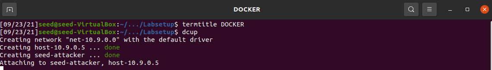
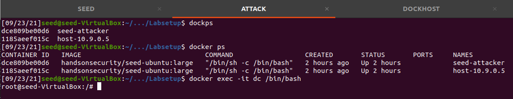
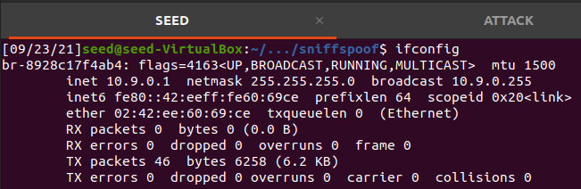
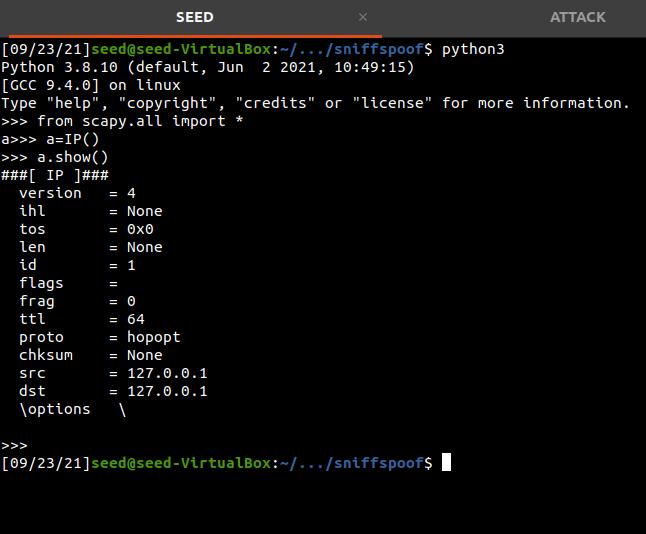
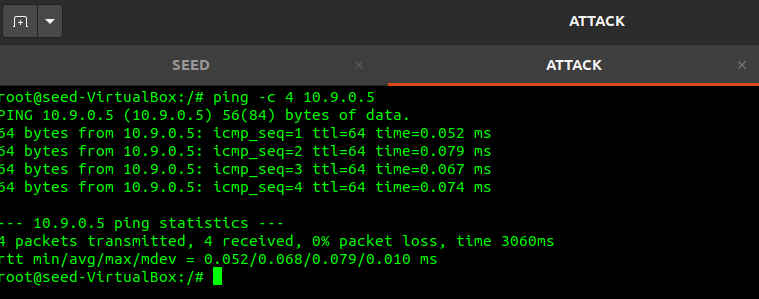
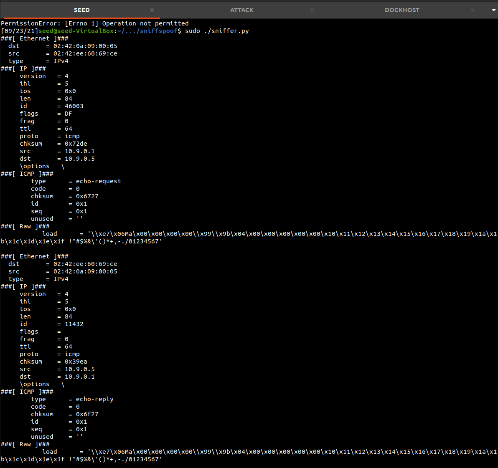
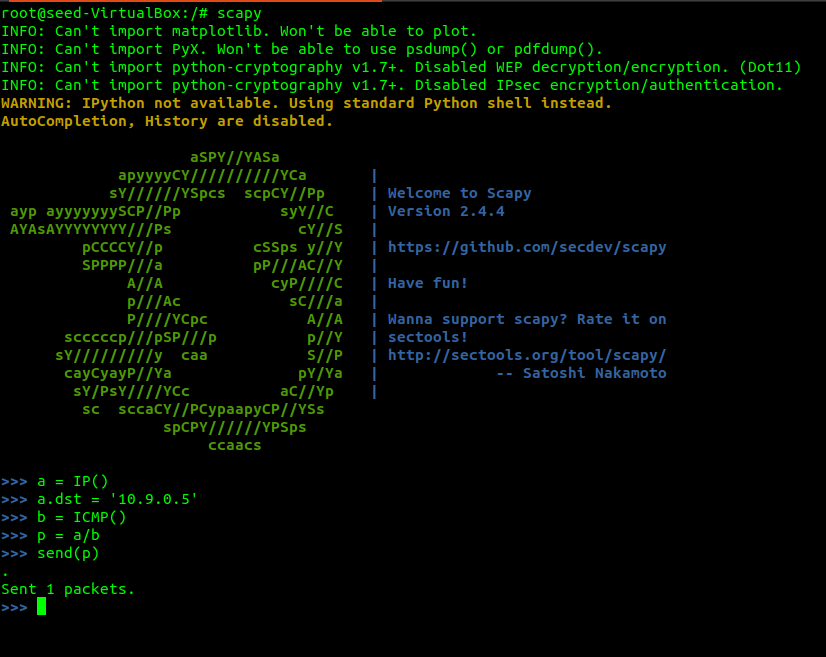
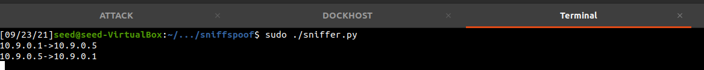

# Packet Sniffing and Spoofing


### Intro

My name is Keith Sabine and I will be working through this SEED security lab as
part of my Undergrad CS studies. 

### Some notes

All of the machine configurations are available on the SEED website.( https://seedsecuritylabs.org/Labs_20.04/Networking/Sniffing_Spoofing/ ). I will only be posting my progress and observations as I work through the lab and answer the questions it requires. I set up the SEED VM using the Ubuntu 20.04 VM config. I will be completing both Task 1 and Task 2.


Environment Setup using Container
----------------------------------
You can download the Labsetup.zip from the Lab website which contains scripts to set up Docker Images. I have never worked with Docker before so this step has been new for me. The lab gives us some commands to build and the SEED VM setup gave us a nice bash config to make these commands easy.

Once you compose the docker images you can use the alias command `dcup` to boot up our Docker network



Next I want to make sure I am able to have a shell open in both the attacker and the host machine for quick testing and reference so I use more of the commands in docker in seperate terminal windows for easy access between the VM and the two docker machines. Use `dockps` to find the ID and the Name of each docker image and then activate a shell in each I named my terminal windows ATTACK and DOCKHOST for the shells I am using in each `docker exec -it dc /bin/bash/` opens the shell @ root level.



The final part of setting up requires getting the network interface that our Docker images will be communicating over. The docker-compose.yml script shows that we have assigned the IP 10.9.0.0/24 to the network so we will need to identify the network device on our VM that matches the script setup. So lets check `ifconfig`



We see the device name on my machine is br-8928c17f4ab4 this is important so I copy it into a textfile for use later.

The Docker is set up and I have the terminals open! Things are looking good so far, but there is a lot more to learn about docker and the environment we have set up here beyond the basic instructions provided by the lab. Seed has posted a comprehensive tutorial for using Docker with their labs and I will keep the link for reference [Docker Tutorial](https://github.com/seed-labs/seed-labs/blob/master/manuals/docker/SEEDManual-Container.md)

Using Scapy to Sniff and Spoof Packets
--------------------------------------

Scapy is a Python program enabling user to send, sniff, dissect, and forge network packets. Time to learn a bit about it for the upcoming tasks!

running the example script:
```python 
from scapy.all import * #We import all modules from Scapy to use
a = IP()
a.show()
```
creates an IP packet for us



Lets use Scapy to do some packet sniffing for us.

### Task 1.1 Sniffing Packets

We are going to take the sample code and run it on our vm, you can find the script in the repo or simply copy/paste it, but be careful as your interface name may be different. notice how sniff requires an interface name, iface, to be specified. iface can be one interface or multiple (use a list).
```python

#!/usr/bin/env python3

def print_pkt(pkt):
	pkt.show()

pkt = sniff(iface='br-8928c17f4ab4' , filter='icmp', prn=print_pkt)


```
#### Task 1.1A

We will sniff from the VM to start. The filter is set for ICMP packets so lets send a ping to the container network interface. Don't forget that root privilege will be needed to view packets. Sending a ping to the br-8928c17f4ab4 interface from the ATTACK container we can sniff the ICMP activity from our VM.



Ping sent!



Running the same program without root privilege results in an Operation not permitted value. Why? Direct access to network devices is restricted to root users. If you didnt need root privilege then every user on a system could potentially control network adapters which would be a bad idea.

#### Task 1.1B 

After messing around with Scapy for awhile trying to get its built in sprintf function to work I caved and created a print function
to neatly display the ICMP traffic like \[SOURCE\] -> \[DEST\]. Now we can test out the filter functionality in scapy.

First we create a packet on the attacker container using scapy


Then with our sniffer.py running a new function: 
```python
#Task 1.1B --- Capturing only the ICMP packets
def icmp_only():
    pkt = sniff(iface='br-8928c17f4ab4' , filter='icmp', prn=pprint_pkt)
```
We see the ICMP packets neatly on the VM


And say we want to send a TCP packet on the same interface, we get no packets showing on our VM terminal. Thanks BPF!

The next task requires us to capture ANY TCP packets that come from a particular IP with a destination port 23. Using the filter option in the sniff() function from scapy allows us to accomplish this simply.

[Packet Sniffing/Spoofing Lab](https://seedsecuritylabs.org/Labs_20.04/Networking/Sniffing_Spoofing/)
