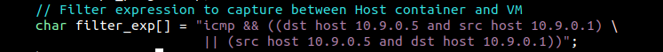
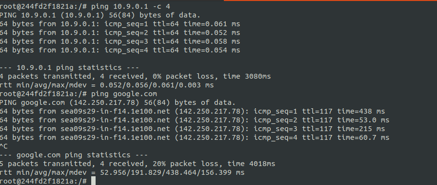
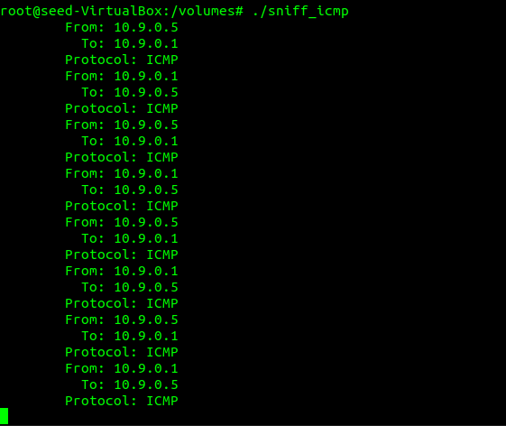

# Packet Sniffing and Spoofing


### Intro

My name is Keith Sabine and I will be working through this SEED security lab as
part of my Undergrad CS studies. 

### Some notes

All of the machine configurations are available on the SEED website.( https://seedsecuritylabs.org/Labs_20.04/Networking/Sniffing_Spoofing/ ). I will only be posting my progress and observations as I work through the lab and answer the questions it requires. I set up the SEED VM using the Ubuntu 20.04 VM config. I will be completing both Task 1 and Task 2.


Environment Setup using Container
----------------------------------
You can download the Labsetup.zip from the Lab website which contains scripts to set up Docker Images. I have never worked with Docker before so this step has been new for me. The lab gives us some commands to build and the SEED VM setup gave us a nice bash config to make these commands easy.

Once you compose the docker images you can use the alias command `dcup` to boot up our Docker network


Next I want to make sure I am able to have a shell open in both the attacker and the host machine for quick testing and reference so I use more of the commands in docker in seperate terminal windows for easy access between the VM and the two docker machines. Use `dockps` to find the ID and the Name of each docker image and then activate a shell in each I named my terminal windows ATTACK and DOCKHOST for the shells I am using in each `docker exec -it dc /bin/bash/` opens the shell @ root level.


The final part of setting up requires getting the network interface that our Docker images will be communicating over. The docker-compose.yml script shows that we have assigned the IP 10.9.0.0/24 to the network so we will need to identify the network device on our VM that matches the script setup. So lets check `ifconfig`


We see the device name on my machine is br-8928c17f4ab4 this is important so I copy it into a textfile for use later.

The Docker is set up and I have the terminals open! Things are looking good so far, but there is a lot more to learn about docker and the environment we have set up here beyond the basic instructions provided by the lab. Seed has posted a comprehensive tutorial for using Docker with their labs and I will keep the link for reference [Docker Tutorial](https://github.com/seed-labs/seed-labs/blob/master/manuals/docker/SEEDManual-Container.md)

Using Scapy to Sniff and Spoof Packets
--------------------------------------

Scapy is a Python program enabling user to send, sniff, dissect, and forge network packets. Time to learn a bit about it for the upcoming tasks!

running the example script:
```python 
from scapy.all import * #We import all modules from Scapy to use
a = IP()
a.show()
```
creates an IP packet for us


Lets use Scapy to do some packet sniffing for us.

### Task 1.1 Sniffing Packets

We are going to take the sample code and run it on our vm, you can find the script in the repo or simply copy/paste it, but be careful as your interface name may be different. notice how sniff requires an interface name, iface, to be specified. iface can be one interface or multiple (use a list).
```python

#!/usr/bin/env python3

def print_pkt(pkt):
	pkt.show()

pkt = sniff(iface='br-8928c17f4ab4' , filter='icmp', prn=print_pkt)


```
#### Task 1.1A

We will sniff from the VM to start. The filter is set for ICMP packets so lets send a ping to the container network interface. Don't forget that root privilege will be needed to view packets. Sending a ping to the br-8928c17f4ab4 interface from the ATTACK container we can sniff the ICMP activity from our VM.


Ping sent!


Running the same program without root privilege results in an Operation not permitted value. Why? Direct access to network devices is restricted to root users. If you didnt need root privilege then every user on a system could potentially control network adapters which would be a bad idea.

#### Task 1.1B 

After messing around with Scapy for awhile trying to get its built in sprintf function to work I caved and created a print function
to neatly display the ICMP traffic like \[SOURCE\] -> \[DEST\]. Now we can test out the filter functionality in scapy.

First we create a packet on the attacker container using scapy


Then with our sniffer.py running a new function: 
```python
#Task 1.1B --- Capturing only the ICMP packets
def icmp_only():
    pkt = sniff(iface='br-8928c17f4ab4' , filter='icmp', prn=pprint_pkt)
```
We see the ICMP packets neatly on the VM


And say we want to send a TCP packet on the same interface, we get no packets showing on our VM terminal. Thanks BPF!

The next task requires us to capture ANY TCP packets that come from a particular IP with a destination port 23. Using the filter option in the sniff() function from scapy allows us to accomplish this simply.

We use the filters option in sniff() scapy function like this:
```python
#Task 1.1B --- Capturing only TCP packets going to port 23
def tcp_port23():
    pkt = sniff(iface='br-8928c17f4ab4', filter='tcp and host 9.9.9.9 and port 23', prn=pprint_pkt)
```

Crafting and sending a packet on my attacking machine gets us no response from the sniffer


When the packet is set to what we filter for however we receive results.


The next task is to set the filter to capture packets coming from or going to a particular subnet. So pick any subnet that the VM is not attached to and try it out. Since we don't want a subnet the VM is attached to we need to change the interface we are observing. So I used the filter function to search for traffic on the internet facing interface. I then sent a ping to 1.2.3.4 and captured it leaving the attacker container to its destination. I used a class A subnet 
```python
#Task 1.1B --- Capturing packets FROM a subnet
def tofrom_subnet():
    pkt = sniff(iface='enp0s3', filter='net 1.0.0.0 mask 255.0.0.0', count=1,prn=pprint_pkt)
```

With this in the python script I sent a packet from my Attacker container to 1.2.3.4


The filter worked!


### TASK 1.2 Spoofing ICMP Packets

We have already used spoofed packets to easily test our filter settings, but lets go over the deatils here. Scapy makes it really intuitive to create spoofed packets.

```python
# We will construct a ICMP packet layer by layer and send it
def spoof_icmp():

    print("SENDING SPOOFED ICMP------------\n")
    a = IP()
    a.dst = '10.9.0.5'
    a.src = '1.2.3.4'
    b = ICMP()
    pkt = a/b
    send(pkt)

spoof_icmp()
```

This script comes directly from the SEED lab instructions except we have inserted a new source IP address and when we execute the script and monitor the network device of our attacker machine we can see that the ICMP packet is sent out with the spoofed source IP address. I used wireshark, but our packet sniffer.py would work to see this as well.


### Task 1.3 Traceroute

The SEED labs want us to create a simple traceroute tool with scapy. So we will do like traceroute does and send an echo-request with a time to live of 1 and listen for an ICMP "Time Exceeded" response then increment the time-to-live until we get an ICMP "port unreachable". The last packet we send will either be the max ttl we assigned or the host. For reference I referred to a workshop on scapy from user [0xbharath](https://0xbharath.github.io/art-of-packet-crafting-with-scapy/network_recon/traceroute/index.html) on github

```python
#--Program is interactable, change address and ttl as you like with
#  command line arguments
# REF: https://0xbharath.github.io/art-of-packet-crafting-with-scapy/network_recon/traceroute/index.html

def scapy_traceroute(addr, ttl):

    ans,unans=sr(IP(dst=addr,ttl=(1,ttl))/ICMP(), timeout=5)
    ans.summary( lambda s,r : r.sprintf("%IP.src% CODE: %ICMP.type%"))


if __name__ == "__main__":

    if len(sys.argv) < 2 or len(sys.argv) > 3:
        print("Simple Scapy traceroute program:\n",
              "USAGE: traceroute.py [ADDRESS] , [TTL]")
        sys.exit(0)

    else:
        addr = sys.argv[1]
        ttl = int(sys.argv[2])
        scapy_traceroute(addr, ttl)
```

This simple tool will output the IP of the source from the packets received as well as the code received at the end. The ICMP codes are important to a tool like traceroute as they allow us to know at what point we reach the destination, or at what point are our probes stopped. A difference in this program is that the scapy sr() function has been given a range of packets to send. It will send ALL packets at once and not one by one like a traceroute -I \[address\] will give us.


In my example you see the tool probing two addresses. I didn't refine it further since there is still much more to go through in the lab!


### Task 1.4 Sniffing and-then Spoofing

Now we will use scapy to create a Sniff and-then Spoof program. It will run on the VM and interact with the User container. The Computer and Internet Security book by Wenliang Du gives us a nice example to use for the program. I've adapted it for the exercise. REMEMBER!!! The network interface on your setup will be different than mine so be sure to specify the correct iface. I ran these commands from the host interface while sniff_spoof_icmp.py was running from my vm:

`ping -c 4 google.com` An existing host on the internet

`ping -c 4 1.2.3.4` A non-existing host on the internet

`ping -c 4 10.9.0.99` A non-existing host on the LAN

`ping -c 4 8.8.8.8` Another existing host on the internet.

The python program appeared to work! At least for the existing hosts outside of the local network.


So why did the local LAN request not go through? We need to understand how the host machine is determining the location of 10.9.0.99, which is the ARP protocol. This is what happened over the network interface when the ping to 10.9.0.99 was sent:


Because 10.9.0.5 and 10.9.0.99 are on the same subnet (remember we set up the machines using the docker-compose.yml script? Yea its in there! The script assigns the network 10.9.0.0 to a subnet:

```
networks:
    net-10.9.0.0:
        name: net-10.9.0.0
        ipam:
            config:
                - subnet: 10.9.0.0/24
```

Visually our network looks like this: (The VM is outside of the subnet, but still has access to the network device)


When the Host machine tries to create a connection with another machine on its own subnet it first needs to know 10.9.0.99 's MAC address. Since there are no replies to the ARP request and the MAC is not stored in the ARP cache on the host machine a connection cannot be made. Ultimately this is why ARP exists, to route traffic on a LAN through the correct interfaces. Unless we modify our python code to also sniff and then spoof an ARP reply our host machine will not know how to communicate with 10.9.0.99 and the ping to it will never be able to be sent.


Writing Programs to Sniff and Spoof Packets
--------------------------------------------

For this part of the lab the C code gets compiled in the VM and then run out of the volumes directory (shared by attacker and VM) and execute the code inside the attacker container. 


### Task 2.1 Writing a Packet Sniffing program

Writing a sniffer program in C requires a bit more attention to detail than scapy, but the concept is similar.
Firstly we need to open capture session on the specified NIC:

```C
handle = pcap_open_live("br-0229d0abdb25", BUFSIZ, 1, 1000, errbuf);
```

pcap_open_live is the library function we use to initialize the session. It fires up a socket for our sniffer to use

```C
pcap_compile(handle, &fp, filter_exp, 0, net);
if (pcap_setfilter(handle, &fp) != 0) {
        pcap_perror(handle, "Error:");
        exit(EXIT_FAILURE);
}
```

pcap_compile and pcap_setfilter compiles and sets the BPF filter on our opened socket

```C
pcap_loop(handle, -1, [CALLBACK FUNCTION], NULL);

```

pcap_loop invokes a loop running over the socket to grab any packets. The CALLBACK FUNCTION is invoked to perform more operations on the packet.

Before the callback function is written we need to define the different layers of our packet in structs in order to type cast our packet into readable chunks.

Before typecasting:
PACKET:

\[....................\]


After:

\[\[ETHER]\[IP\]\[.....\]


We can then increment the sizeof our structure on our captured packet to move the pointer around and analyze each partof it. I used the textbook here for reference and I won't post all of my code in the report, but here's the result of my program capturing packets on my attacker container coming from the host container over the docker network.


#### TASK 2.1A Understanding how a Sniffer works

The sniffer works because of the packet capture library. So I will answer the questions in the lab here.

##### 1.
The library calls that are essential for a sniffer program are the calls that create a socket on which to access the NIC through our OS from our program and pcap_open_live() establishes this. We also need a way to understand what we are receiving, by compiling the BPF filter on our socket we are ready to use established filtering expressions on our packet and conversely understanding incoming packets as well we do this with pcap_compile and pcap_setfilter. We then need a call that will loop over the socket in order to capture and analyze the packets, which we have in pcap_loop. We also need a way to close the socket and pcap_close is the library call that we use.

##### 2.
Root privilege is required to run a sniffer program in because we need special access in order to perform actions directly on the NIC, specifically creating a raw socket and activating promiscuous mode on the NIC. The program would fail specifically at the operating system, as the library call is run that opens a raw socket to the NIC. The operating system will attempt the system call required and the kernel will determine the user's privileges and deny the program access to use the system calls invoked by pcap if their privileges are insufficient.


##### 3.
Promiscuous mode allows the NIC to listen to ALL the traffic on its LAN and without promiscuous mode enabled the NIC only see traffic passing to that particular interface. HOWEVER Since the attacker container has been set into host mode it allows the attacker to see ALL traffics on the LAN we set up, it sees all the network interfaces of the host so setting the promiscuous mode to 0 or 1 on the attacker container gives the same result.


#### TASK 2.1B Writing Filters

We now need to write BPF filter expressions for the sniffer program to capture specific packets.

Capturing ICMP packets between two specific hosts:

This task just requires us to use a BPF expression in the filter_exp string to ensure we capture the correct packets with sniff_icmp program.



With this expression in place we are capturing packets only between the Host container and the VM

When I send out pings from the host:



And the output our sniff_icmp program outputs only the icmp packets that were sent between the two hosts. The google.com pings were not intercepted by the sniff_icmp program




The next task is Capturing TCP packets with a destination port number in the range of 10 to 100:


Again we change our filter expression to reflect the packets we want to intercept on the interface.


```C
char filter_exp[] = "tcp portrange 10-100";

```

This filter will ensure we are getting the packets we want for the task. In order to test this I went ahead and defined a tcpheader structure inside the code to use the same technique for finding the beginning of the IP header, this time we need to multiply the IP header length field by 4 (since the header length is the number of words the header containrs) and then use the packet pointer to move ahead by the size of the ethernet header and the IP header to arrive at the TCP header. I used the pcap tutorial to find a very useful approach to creating the new header the pcap tutorial by Tim Carstens, here is the link for reference: [pcap programming tutorial](http://www.tcpdump.org/pcap.htm)

```C
ip_size = ip->iph_ihl * 4;
struct tcpheader * tcp = (struct tcpheader *)(packet + sizeof(struct ethheader) + ip_size);
```

Then to verify that we are only getting the correct ports I've added in a print statement to pull the destination port (what we are filtering for) and print it out for us. We need to use the arpa/inet.h library for this in order to convert the network bytes into host bytes. If we don't convert the byte order then incorrect values will be printed! This function is provided by [arpa/inet.h](https://pubs.opengroup.org/onlinepubs/007908799/xns/arpainet.h.html):

```C
// This function from arpa/inet.h will convert NETWORK order bytes to HOST order bytes!
uint16_t ntohs(uint16_t netshort);
```

To demonstrate the filter actually works I created a quick Scapy script it sends out tcp packets to 1.2.3.4 from port 10-500. Our program only picks up the first 91 packets (10-100 inclusive) so we know the filter expression works.

Some screenshots:

The scapy Script


The program receive packets


And skipped a bit to show where the packet capture did not continue after the scapy script executed on host


#### TASK 2.1C Sniffing Passwords
Using our sniffer program to capture telnet passwords on the network we are monitoring this requires us to modify our code again to be able to receive and read the payload data received/sent by each tcp packet. I changed my filter_expression slightly, to grab all traffic from and to port 23 since I will be capturing port 23(telnet) and need to see the password prompt to know when the unsuspecting user is entering their password (and clearly demonstrate it). Again I highly recommend checking out Tim Carsten's tutorial on using [pcaplib](http://www.tcpdump.org/pcap.htm) In my code sniff_telnet_pass.c I have used several of his functions to print out the payload part of the packet in a readable form. Lets take a look at how its working.

The unsuspecting host logs into telnet, blissfully unaware that some malicious actor is listening to the traffic:


sniff_telnet_pass springs into action on the attacker container. Showing us exactly what is going on. And there it is, the password. Thanks!


### TASK 2.2 Spoofing

#### Task 2.2A Write a spoofing program

#### Task 2.2B Spoof an ICMP echo request.

#### Questions

##### 4.
##### 5.
##### 6.


### TASK 2.3 Sniff and Then Spoof
*Bonus*

[Packet Sniffing/Spoofing Lab](https://seedsecuritylabs.org/Labs_20.04/Networking/Sniffing_Spoofing/)
